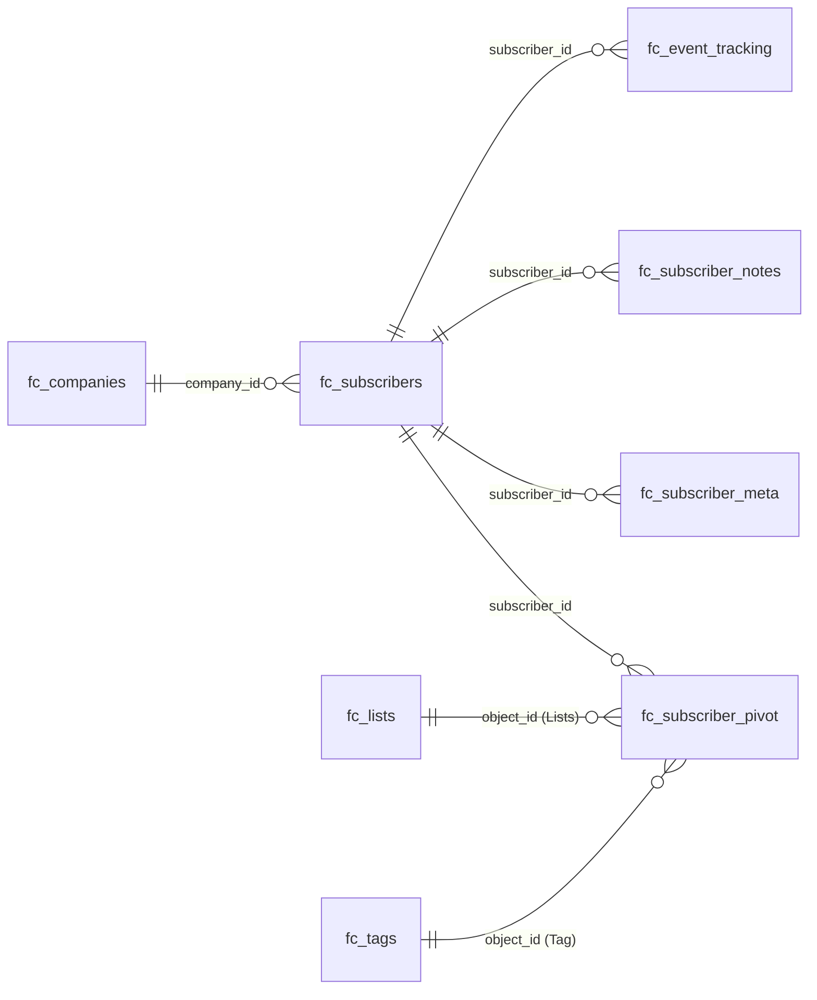
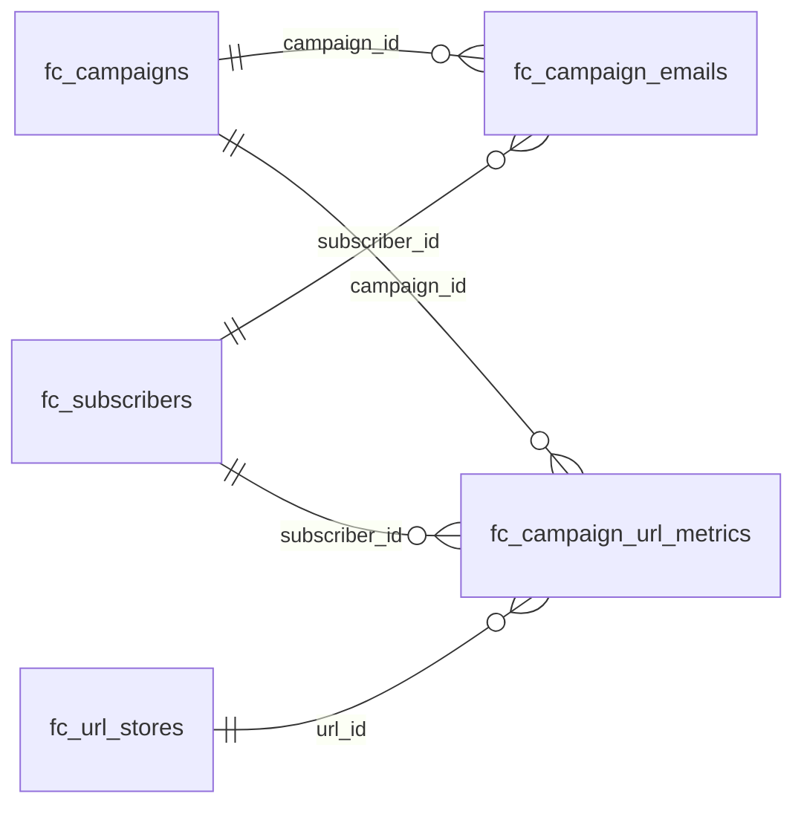
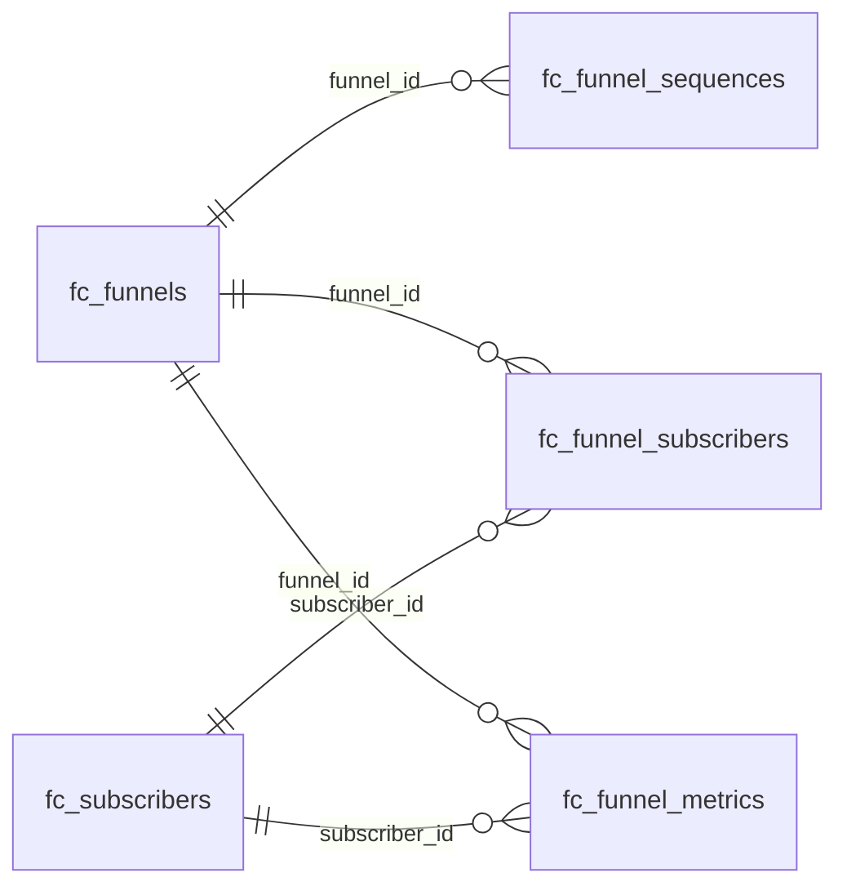

# FluentCRM Database Schema

<Badge type="tip" vertical="top" text="FluentCRM Core" /> <Badge type="warning" vertical="top" text="Advanced" />

FluentCRM uses custom database tables to store all CRM data. This page lists each table and its columns so you can see the overall database design and the data attributes of each model.

::: info Table prefix
Every table name below is shown without the WordPress prefix. On a default install `fc_subscribers` is stored as `wp_fc_subscribers`; use `$wpdb->prefix` in code.
:::

## Schema Design

Each line is a `*_id` column pointing at the table it references. Use the buttons to zoom, drag to pan, or open the diagram full screen.

### Contacts

`fc_subscriber_pivot` is shared by lists and tags and is told apart by `object_type`.

<ZoomBox>

</ZoomBox>

### Campaigns

<ZoomBox>

</ZoomBox>

### Automations

<ZoomBox>

</ZoomBox>

## FluentCRM Core Tables

### fc_subscribers

A contact (subscriber). Central table that most other tables reference through `subscriber_id`.

| Column | Type | Null | Default | Extra |
|---|---|---|---|---|
| `id` | bigint unsigned | NO | — | auto_increment |
| `user_id` | bigint unsigned | YES | NULL |  |
| `hash` | varchar(90) | YES | NULL |  |
| `contact_owner` | bigint unsigned | YES | NULL |  |
| `company_id` | bigint unsigned | YES | NULL |  |
| `prefix` | varchar(192) | YES | NULL |  |
| `first_name` | varchar(192) | YES | NULL |  |
| `last_name` | varchar(192) | YES | NULL |  |
| `email` | varchar(190) | NO | — |  |
| `timezone` | varchar(192) | YES | NULL |  |
| `address_line_1` | varchar(192) | YES | NULL |  |
| `address_line_2` | varchar(192) | YES | NULL |  |
| `postal_code` | varchar(192) | YES | NULL |  |
| `city` | varchar(192) | YES | NULL |  |
| `state` | varchar(192) | YES | NULL |  |
| `country` | varchar(192) | YES | NULL |  |
| `ip` | varchar(40) | YES | NULL |  |
| `latitude` | decimal(10,8) | YES | NULL |  |
| `longitude` | decimal(10,8) | YES | NULL |  |
| `total_points` | int unsigned | NO | `0` |  |
| `life_time_value` | int unsigned | NO | `0` |  |
| `phone` | varchar(50) | YES | NULL |  |
| `status` | varchar(50) | NO | `subscribed` |  |
| `contact_type` | varchar(50) | YES | `lead` |  |
| `source` | varchar(50) | YES | NULL |  |
| `avatar` | varchar(192) | YES | NULL |  |
| `date_of_birth` | date | YES | NULL |  |
| `created_at` | timestamp | YES | NULL |  |
| `last_activity` | timestamp | YES | NULL |  |
| `updated_at` | timestamp | YES | NULL |  |

### fc_tags

Tags that can be attached to contacts. Assignments are stored in `fc_subscriber_pivot` with `object_type = FluentCrm\App\Models\Tag`.

| Column | Type | Null | Default | Extra |
|---|---|---|---|---|
| `id` | int unsigned | NO | — | auto_increment |
| `title` | varchar(192) | NO | — |  |
| `slug` | varchar(192) | NO | — |  |
| `description` | tinytext | YES | NULL |  |
| `created_at` | timestamp | YES | NULL |  |
| `updated_at` | timestamp | YES | NULL |  |

### fc_lists

Lists that can be attached to contacts. Assignments are stored in `fc_subscriber_pivot` with `object_type = FluentCrm\App\Models\Lists`.

| Column | Type | Null | Default | Extra |
|---|---|---|---|---|
| `id` | int unsigned | NO | — | auto_increment |
| `title` | varchar(192) | NO | — |  |
| `slug` | varchar(192) | NO | — |  |
| `description` | tinytext | YES | NULL |  |
| `is_public` | tinyint(1) | YES | `0` |  |
| `created_at` | timestamp | YES | NULL |  |
| `updated_at` | timestamp | YES | NULL |  |

### fc_subscriber_pivot

Pivot table linking contacts to lists and tags. Always filter on `object_type`.

| Column | Type | Null | Default | Extra |
|---|---|---|---|---|
| `id` | bigint unsigned | NO | — | auto_increment |
| `subscriber_id` | bigint unsigned | NO | — |  |
| `object_id` | bigint unsigned | NO | — |  |
| `object_type` | varchar(50) | NO | — |  |
| `status` | varchar(50) | YES | NULL |  |
| `is_public` | tinyint(1) | NO | `1` |  |
| `created_at` | timestamp | YES | NULL |  |
| `updated_at` | timestamp | YES | NULL |  |

### fc_subscriber_meta

Key/value meta for contacts, including custom field values.

| Column | Type | Null | Default | Extra |
|---|---|---|---|---|
| `id` | bigint unsigned | NO | — | auto_increment |
| `subscriber_id` | bigint unsigned | NO | — |  |
| `created_by` | bigint unsigned | NO | — |  |
| `object_type` | varchar(50) | YES | `option` |  |
| `key` | varchar(192) | NO | — |  |
| `value` | longtext | YES | NULL |  |
| `created_at` | timestamp | YES | NULL |  |
| `updated_at` | timestamp | YES | NULL |  |

### fc_subscriber_notes

Notes and activity entries recorded on a contact. Always filter on `type`.

| Column | Type | Null | Default | Extra |
|---|---|---|---|---|
| `id` | bigint unsigned | NO | — | auto_increment |
| `subscriber_id` | bigint unsigned | NO | — |  |
| `parent_id` | bigint unsigned | YES | NULL |  |
| `created_by` | bigint unsigned | YES | NULL |  |
| `status` | varchar(50) | YES | `open` |  |
| `type` | varchar(50) | YES | `note` |  |
| `is_private` | tinyint | YES | `1` |  |
| `title` | varchar(192) | YES | NULL |  |
| `description` | longtext | YES | NULL |  |
| `created_at` | timestamp | YES | NULL |  |
| `updated_at` | timestamp | YES | NULL |  |

### fc_companies

Companies. The company module is disabled by default, so this table may not exist until it is enabled.

| Column | Type | Null | Default | Extra |
|---|---|---|---|---|
| `id` | bigint unsigned | NO | — | auto_increment |
| `hash` | varchar(90) | YES | NULL |  |
| `owner_id` | bigint unsigned | YES | NULL |  |
| `name` | varchar(192) | YES | NULL |  |
| `industry` | varchar(192) | YES | NULL |  |
| `email` | varchar(190) | YES | NULL |  |
| `timezone` | varchar(192) | YES | NULL |  |
| `address_line_1` | varchar(192) | YES | NULL |  |
| `address_line_2` | varchar(192) | YES | NULL |  |
| `postal_code` | varchar(192) | YES | NULL |  |
| `city` | varchar(192) | YES | NULL |  |
| `state` | varchar(192) | YES | NULL |  |
| `country` | varchar(192) | YES | NULL |  |
| `employees_number` | int unsigned | YES | `0` |  |
| `description` | longtext | YES | NULL |  |
| `phone` | varchar(50) | YES | NULL |  |
| `type` | varchar(50) | YES | `` |  |
| `logo` | varchar(192) | YES | NULL |  |
| `website` | varchar(192) | YES | NULL |  |
| `linkedin_url` | varchar(192) | YES | NULL |  |
| `facebook_url` | varchar(192) | YES | NULL |  |
| `twitter_url` | varchar(192) | YES | NULL |  |
| `date_of_start` | date | YES | NULL |  |
| `meta` | longtext | YES | NULL |  |
| `created_at` | timestamp | YES | NULL |  |
| `updated_at` | timestamp | YES | NULL |  |

### fc_campaigns

Email campaigns, including recurring campaigns and email sequences.

| Column | Type | Null | Default | Extra |
|---|---|---|---|---|
| `id` | bigint unsigned | NO | — | auto_increment |
| `parent_id` | bigint unsigned | YES | NULL |  |
| `type` | varchar(50) | NO | `campaign` |  |
| `title` | varchar(192) | NO | — |  |
| `available_urls` | text | YES | NULL |  |
| `slug` | varchar(192) | NO | — |  |
| `status` | varchar(50) | NO | — |  |
| `template_id` | bigint unsigned | YES | NULL |  |
| `email_subject` | varchar(192) | YES | NULL |  |
| `email_pre_header` | varchar(192) | YES | NULL |  |
| `email_body` | longtext | NO | — |  |
| `recipients_count` | int | NO | `0` |  |
| `delay` | int | YES | `0` |  |
| `utm_status` | tinyint(1) | YES | `0` |  |
| `utm_source` | varchar(192) | YES | NULL |  |
| `utm_medium` | varchar(192) | YES | NULL |  |
| `utm_campaign` | varchar(192) | YES | NULL |  |
| `utm_term` | varchar(192) | YES | NULL |  |
| `utm_content` | varchar(192) | YES | NULL |  |
| `design_template` | varchar(192) | YES | NULL |  |
| `scheduled_at` | timestamp | YES | NULL |  |
| `settings` | longtext | YES | NULL |  |
| `created_by` | bigint unsigned | YES | NULL |  |
| `created_at` | timestamp | YES | NULL |  |
| `updated_at` | timestamp | YES | NULL |  |

### fc_campaign_emails

One row per email queued or sent for a campaign or automation.

| Column | Type | Null | Default | Extra |
|---|---|---|---|---|
| `id` | bigint unsigned | NO | — | auto_increment |
| `campaign_id` | bigint unsigned | YES | NULL |  |
| `email_type` | varchar(50) | YES | `campaign` |  |
| `subscriber_id` | bigint unsigned | YES | NULL |  |
| `email_subject_id` | bigint unsigned | YES | NULL |  |
| `email_address` | varchar(192) | NO | — |  |
| `email_subject` | varchar(192) | YES | NULL |  |
| `email_body` | longtext | YES | NULL |  |
| `email_headers` | text | YES | NULL |  |
| `is_open` | tinyint(1) | NO | `0` |  |
| `is_parsed` | tinyint(1) | NO | `0` |  |
| `click_counter` | int | YES | NULL |  |
| `status` | varchar(50) | NO | `draft` |  |
| `note` | text | YES | NULL |  |
| `scheduled_at` | timestamp | YES | NULL |  |
| `email_hash` | varchar(192) | YES | NULL |  |
| `created_at` | timestamp | YES | NULL |  |
| `updated_at` | timestamp | YES | NULL |  |

### fc_campaign_url_metrics

Click and open tracking per URL, campaign and contact.

| Column | Type | Null | Default | Extra |
|---|---|---|---|---|
| `id` | bigint unsigned | NO | — | auto_increment |
| `url_id` | bigint unsigned | YES | NULL |  |
| `campaign_id` | bigint unsigned | YES | NULL |  |
| `subscriber_id` | bigint unsigned | YES | NULL |  |
| `type` | varchar(50) | YES | `click` |  |
| `ip_address` | varchar(30) | YES | NULL |  |
| `country` | varchar(40) | YES | NULL |  |
| `city` | varchar(40) | YES | NULL |  |
| `counter` | int unsigned | NO | `1` |  |
| `created_at` | timestamp | YES | NULL |  |
| `updated_at` | timestamp | YES | NULL |  |

### fc_url_stores

Short URL store used for click tracking.

| Column | Type | Null | Default | Extra |
|---|---|---|---|---|
| `id` | bigint unsigned | NO | — | auto_increment |
| `url` | text | NO | — |  |
| `short` | varchar(50) | NO | — |  |
| `created_at` | timestamp | YES | NULL |  |
| `updated_at` | timestamp | YES | NULL |  |

### fc_funnels

Automation funnels.

| Column | Type | Null | Default | Extra |
|---|---|---|---|---|
| `id` | bigint unsigned | NO | — | auto_increment |
| `type` | varchar(50) | NO | `funnel` |  |
| `title` | varchar(192) | NO | — |  |
| `trigger_name` | varchar(150) | YES | NULL |  |
| `status` | varchar(50) | YES | `draft` |  |
| `conditions` | text | YES | NULL |  |
| `settings` | text | YES | NULL |  |
| `created_by` | bigint unsigned | YES | NULL |  |
| `created_at` | timestamp | YES | NULL |  |
| `updated_at` | timestamp | YES | NULL |  |

### fc_funnel_sequences

Steps (actions, conditions and benchmarks) of an automation funnel.

| Column | Type | Null | Default | Extra |
|---|---|---|---|---|
| `id` | bigint unsigned | NO | — | auto_increment |
| `funnel_id` | bigint unsigned | YES | NULL |  |
| `parent_id` | bigint unsigned | YES | `0` |  |
| `action_name` | varchar(192) | YES | NULL |  |
| `condition_type` | varchar(192) | YES | NULL |  |
| `type` | varchar(50) | YES | `sequence` |  |
| `title` | varchar(192) | YES | NULL |  |
| `description` | varchar(192) | YES | NULL |  |
| `status` | varchar(50) | YES | `draft` |  |
| `conditions` | text | YES | NULL |  |
| `settings` | text | YES | NULL |  |
| `note` | text | YES | NULL |  |
| `delay` | int unsigned | YES | NULL |  |
| `c_delay` | int unsigned | YES | NULL |  |
| `sequence` | int unsigned | YES | NULL |  |
| `created_by` | bigint unsigned | YES | NULL |  |
| `created_at` | timestamp | YES | NULL |  |
| `updated_at` | timestamp | YES | NULL |  |

### fc_funnel_subscribers

Contacts enrolled in an automation funnel and their progress.

| Column | Type | Null | Default | Extra |
|---|---|---|---|---|
| `id` | bigint unsigned | NO | — | auto_increment |
| `funnel_id` | bigint unsigned | YES | NULL |  |
| `starting_sequence_id` | bigint unsigned | YES | NULL |  |
| `next_sequence` | bigint unsigned | YES | NULL |  |
| `subscriber_id` | bigint unsigned | YES | NULL |  |
| `last_sequence_id` | bigint unsigned | YES | NULL |  |
| `next_sequence_id` | bigint unsigned | YES | NULL |  |
| `last_sequence_status` | varchar(50) | YES | `pending` |  |
| `status` | varchar(50) | YES | `active` |  |
| `type` | varchar(50) | YES | `funnel` |  |
| `last_executed_time` | timestamp | YES | NULL |  |
| `next_execution_time` | timestamp | YES | NULL |  |
| `notes` | text | YES | NULL |  |
| `source_trigger_name` | varchar(192) | YES | NULL |  |
| `source_ref_id` | bigint unsigned | YES | NULL |  |
| `created_at` | timestamp | YES | NULL |  |
| `updated_at` | timestamp | YES | NULL |  |

### fc_funnel_metrics

Goal and benchmark metrics recorded for automation funnels.

| Column | Type | Null | Default | Extra |
|---|---|---|---|---|
| `id` | bigint unsigned | NO | — | auto_increment |
| `funnel_id` | bigint unsigned | YES | NULL |  |
| `sequence_id` | bigint unsigned | YES | NULL |  |
| `subscriber_id` | bigint unsigned | YES | NULL |  |
| `benchmark_value` | bigint unsigned | YES | `0` |  |
| `benchmark_currency` | varchar(10) | YES | `USD` |  |
| `status` | varchar(50) | YES | `completed` |  |
| `notes` | text | YES | NULL |  |
| `created_at` | timestamp | YES | NULL |  |
| `updated_at` | timestamp | YES | NULL |  |

### fc_event_tracking

Custom events tracked against a contact.

| Column | Type | Null | Default | Extra |
|---|---|---|---|---|
| `id` | bigint unsigned | NO | — | auto_increment |
| `subscriber_id` | bigint unsigned | NO | — |  |
| `counter` | int unsigned | YES | `1` |  |
| `created_by` | bigint unsigned | YES | NULL |  |
| `provider` | varchar(50) | YES | `custom` |  |
| `event_key` | varchar(192) | NO | — |  |
| `title` | varchar(192) | NO | — |  |
| `value` | text | YES | NULL |  |
| `created_at` | timestamp | YES | NULL |  |
| `updated_at` | timestamp | YES | NULL |  |

### fc_activity_logs

Audit trail of admin activity. Created lazily by the activity log migrator.

| Column | Type | Null | Default | Extra |
|---|---|---|---|---|
| `id` | bigint unsigned | NO | — | auto_increment |
| `object_type` | varchar(192) | NO | — |  |
| `object_id` | bigint | YES | NULL |  |
| `action` | varchar(192) | NO | — |  |
| `source` | varchar(50) | YES | `wp_admin` |  |
| `description` | text | YES | NULL |  |
| `activity_by` | bigint unsigned | YES | NULL |  |
| `created_at` | timestamp | YES | NULL |  |
| `updated_at` | timestamp | YES | NULL |  |

### fc_terms

Generic taxonomy terms. Currently used for labels (`taxonomy_name = global_label`).

| Column | Type | Null | Default | Extra |
|---|---|---|---|---|
| `id` | bigint unsigned | NO | — | auto_increment |
| `parent_id` | bigint unsigned | YES | NULL |  |
| `taxonomy_name` | varchar(50) | NO | — |  |
| `slug` | varchar(100) | NO | — |  |
| `title` | text | YES | NULL |  |
| `position` | decimal(10,2) | NO | `1.00` |  |
| `description` | longtext | YES | NULL |  |
| `settings` | longtext | YES | NULL |  |
| `created_at` | timestamp | YES | NULL |  |
| `updated_at` | timestamp | YES | NULL |  |

### fc_term_relations

Links taxonomy terms to objects.

| Column | Type | Null | Default | Extra |
|---|---|---|---|---|
| `id` | bigint unsigned | NO | — | auto_increment |
| `term_id` | bigint unsigned | YES | NULL |  |
| `object_type` | varchar(192) | NO | — |  |
| `object_id` | bigint | YES | NULL |  |
| `settings` | longtext | YES | NULL |  |
| `created_at` | timestamp | YES | NULL |  |
| `updated_at` | timestamp | YES | NULL |  |

### fc_meta

CRM settings and shared meta. Always filter on `object_type` and `key`.

| Column | Type | Null | Default | Extra |
|---|---|---|---|---|
| `id` | bigint unsigned | NO | — | auto_increment |
| `object_type` | varchar(50) | NO | — |  |
| `object_id` | bigint | YES | NULL |  |
| `key` | varchar(192) | NO | — |  |
| `value` | longtext | YES | NULL |  |
| `created_at` | timestamp | YES | NULL |  |
| `updated_at` | timestamp | YES | NULL |  |

## FluentCampaign Pro Tables

<Badge type="warning" vertical="top" text="Pro" /> These tables are created by FluentCampaign Pro and only exist when it is installed.

### fc_sequence_tracker

Per-contact progress through an email sequence.

| Column | Type | Null | Default | Extra |
|---|---|---|---|---|
| `id` | bigint unsigned | NO | — | auto_increment |
| `campaign_id` | bigint unsigned | YES | NULL |  |
| `last_sequence_id` | bigint unsigned | YES | NULL |  |
| `subscriber_id` | bigint unsigned | YES | NULL |  |
| `next_sequence_id` | bigint unsigned | YES | NULL |  |
| `status` | varchar(50) | YES | `active` |  |
| `type` | varchar(50) | YES | `sequence_tracker` |  |
| `last_executed_time` | timestamp | YES | NULL |  |
| `next_execution_time` | timestamp | YES | NULL |  |
| `notes` | text | YES | NULL |  |
| `created_at` | timestamp | YES | NULL |  |
| `updated_at` | timestamp | YES | NULL |  |

### fc_contact_relations

Per-contact summary for each ecommerce or LMS provider that has been synced.

| Column | Type | Null | Default | Extra |
|---|---|---|---|---|
| `id` | bigint unsigned | NO | — | auto_increment |
| `subscriber_id` | bigint unsigned | NO | — |  |
| `provider` | varchar(100) | NO | — |  |
| `provider_id` | bigint unsigned | YES | NULL |  |
| `first_order_date` | timestamp | YES | NULL |  |
| `last_order_date` | timestamp | YES | NULL |  |
| `total_order_count` | int | YES | `0` |  |
| `total_order_value` | decimal(10, 2) | YES | `0` |  |
| `status` | varchar(100) | YES | NULL |  |
| `commerce_taxonomies` | longtext | YES | NULL |  |
| `commerce_coupons` | longtext | YES | NULL |  |
| `meta_col_1` | mediumtext | YES | NULL |  |
| `meta_col_2` | mediumtext | YES | NULL |  |
| `created_at` | timestamp | YES | NULL |  |
| `updated_at` | timestamp | YES | NULL |  |

### fc_contact_relation_items

Individual orders, products or enrollments behind a `fc_contact_relations` row.

| Column | Type | Null | Default | Extra |
|---|---|---|---|---|
| `id` | bigint unsigned | NO | — | auto_increment |
| `subscriber_id` | bigint unsigned | NO | — |  |
| `relation_id` | bigint unsigned | NO | — |  |
| `provider` | varchar(100) | NO | — |  |
| `origin_id` | bigint unsigned | YES | NULL |  |
| `item_id` | bigint unsigned | NO | — |  |
| `item_sub_id` | bigint unsigned | YES | NULL |  |
| `item_value` | decimal(10, 2) | YES | NULL |  |
| `status` | varchar(100) | YES | NULL |  |
| `item_type` | varchar(100) | YES | NULL |  |
| `meta_col` | mediumtext | YES | NULL |  |
| `created_at` | timestamp | YES | NULL |  |
| `updated_at` | timestamp | YES | NULL |  |

### fc_smart_links

Smart links and their click counters.

| Column | Type | Null | Default | Extra |
|---|---|---|---|---|
| `id` | bigint unsigned | NO | — | auto_increment |
| `title` | varchar(192) | YES | NULL |  |
| `short` | varchar(192) | YES | NULL |  |
| `target_url` | text | YES | NULL |  |
| `actions` | text | YES | NULL |  |
| `notes` | text | YES | NULL |  |
| `contact_clicks` | int | YES | `0` |  |
| `all_clicks` | int | YES | `0` |  |
| `created_by` | bigint unsigned | YES | NULL |  |
| `created_at` | timestamp | YES | NULL |  |
| `updated_at` | timestamp | YES | NULL |  |

### fc_message_templates

Templates for the messaging channels (WhatsApp and SMS).

| Column | Type | Null | Default | Extra |
|---|---|---|---|---|
| `id` | bigint unsigned | NO | — | auto_increment |
| `channel` | varchar(20) | NO | `whatsapp` |  |
| `name` | varchar(192) | NO | — |  |
| `language` | varchar(20) | NO | `en_US` |  |
| `category` | varchar(50) | YES | NULL |  |
| `status` | varchar(20) | NO | `PENDING` |  |
| `header_text` | varchar(255) | YES | NULL |  |
| `body_text` | text | NO | — |  |
| `footer_text` | varchar(255) | YES | NULL |  |
| `buttons` | longtext | YES | NULL |  |
| `variables` | longtext | YES | NULL |  |
| `provider` | varchar(50) | YES | NULL |  |
| `provider_template_id` | varchar(192) | YES | NULL |  |
| `rejection_reason` | text | YES | NULL |  |
| `last_synced_at` | timestamp | YES | NULL |  |
| `created_by` | bigint unsigned | YES | NULL |  |
| `created_at` | timestamp | YES | NULL |  |
| `updated_at` | timestamp | YES | NULL |  |

### fc_message_threads

Conversation threads, one per contact and channel.

| Column | Type | Null | Default | Extra |
|---|---|---|---|---|
| `id` | bigint unsigned | NO | — | auto_increment |
| `contact_id` | bigint unsigned | YES | NULL |  |
| `channel` | varchar(20) | NO | `sms` |  |
| `phone_number` | varchar(20) | NO | — |  |
| `status` | varchar(20) | NO | `subscribed` |  |
| `initiated_by` | varchar(20) | NO | `user` |  |
| `last_seen_id` | bigint unsigned | YES | NULL |  |
| `last_message_id` | bigint unsigned | YES | NULL |  |
| `has_unread` | tinyint(1) | NO | `0` |  |
| `unread_count` | int unsigned | NO | `0` |  |
| `meta` | longtext | YES | NULL |  |
| `created_at` | timestamp | YES | NULL |  |
| `updated_at` | timestamp | YES | NULL |  |

### fc_messages

Individual messages inside a thread.

| Column | Type | Null | Default | Extra |
|---|---|---|---|---|
| `id` | bigint unsigned | NO | — | auto_increment |
| `thread_id` | bigint unsigned | NO | — |  |
| `direction` | varchar(20) | NO | `outbound` |  |
| `content` | text | YES | NULL |  |
| `ref_id` | bigint unsigned | YES | NULL |  |
| `ref_type` | varchar(50) | YES | NULL |  |
| `status` | varchar(50) | NO | `pending` |  |
| `provider_message_id` | varchar(100) | YES | NULL |  |
| `scheduled_at` | timestamp | YES | NULL |  |
| `sent_at` | timestamp | YES | NULL |  |
| `meta` | longtext | YES | NULL |  |
| `created_by` | bigint unsigned | YES | NULL |  |
| `created_at` | timestamp | YES | NULL |  |
| `updated_at` | timestamp | YES | NULL |  |
| `activity_at` | datetime | YES | NULL | STORED GENERATED |

### fc_sms_campaigns

Messaging campaigns. Despite the name this table is still live: the `MessageCampaign` model stores campaigns for **both** channels here, with the channel kept on the row.

| Column | Type | Null | Default | Extra |
|---|---|---|---|---|
| `id` | bigint unsigned | NO | — | auto_increment |
| `parent_id` | bigint unsigned | YES | NULL |  |
| `type` | varchar(50) | NO | `campaign` |  |
| `title` | varchar(192) | NO | — |  |
| `slug` | varchar(192) | NO | — |  |
| `status` | varchar(50) | NO | `draft` |  |
| `message_content` | text | NO | — |  |
| `sender_number` | varchar(20) | YES | NULL |  |
| `recipients_count` | int unsigned | NO | `0` |  |
| `sent_count` | int unsigned | NO | `0` |  |
| `failed_count` | int unsigned | NO | `0` |  |
| `delay` | int unsigned | YES | `0` |  |
| `scheduled_at` | timestamp | YES | NULL |  |
| `settings` | longtext | YES | NULL |  |
| `channel` | varchar(20) | NO | `sms` |  |
| `created_by` | bigint unsigned | YES | NULL |  |
| `created_at` | timestamp | YES | NULL |  |
| `updated_at` | timestamp | YES | NULL |  |

### fc_sms_messages

::: warning Legacy table
Since Messaging (3.2.0), new messages are written to [`fc_message_threads`](#fc-message-threads) and [`fc_messages`](#fc-messages). This table is the source for the one-time, batched migration (`GET`/`POST /messaging/migration`) and is kept so history is not lost; the `LegacyMessage` model reads it. Do not write to it.
:::

SMS messages sent for a campaign (legacy).

| Column | Type | Null | Default | Extra |
|---|---|---|---|---|
| `id` | bigint unsigned | NO | — | auto_increment |
| `campaign_id` | bigint unsigned | YES | NULL |  |
| `template_id` | bigint unsigned | YES | NULL |  |
| `sms_type` | varchar(50) | YES | `campaign` |  |
| `subscriber_id` | bigint unsigned | YES | NULL |  |
| `mobile_number` | varchar(20) | YES | NULL |  |
| `click_counter` | int unsigned | YES | `0` |  |
| `message_content` | text | YES | NULL |  |
| `status` | varchar(50) | NO | `pending` |  |
| `delivery_status` | varchar(50) | YES | `queued` |  |
| `notes` | text | YES | NULL |  |
| `provider_message_id` | varchar(100) | YES | NULL |  |
| `settings` | longtext | YES | NULL |  |
| `channel` | varchar(20) | NO | `sms` |  |
| `direction` | varchar(20) | NO | `outbound` |  |
| `scheduled_at` | timestamp | YES | NULL |  |
| `sent_at` | timestamp | YES | NULL |  |
| `delivered_at` | timestamp | YES | NULL |  |
| `read_at` | timestamp | YES | NULL |  |
| `created_at` | timestamp | YES | NULL |  |
| `updated_at` | timestamp | YES | NULL |  |
